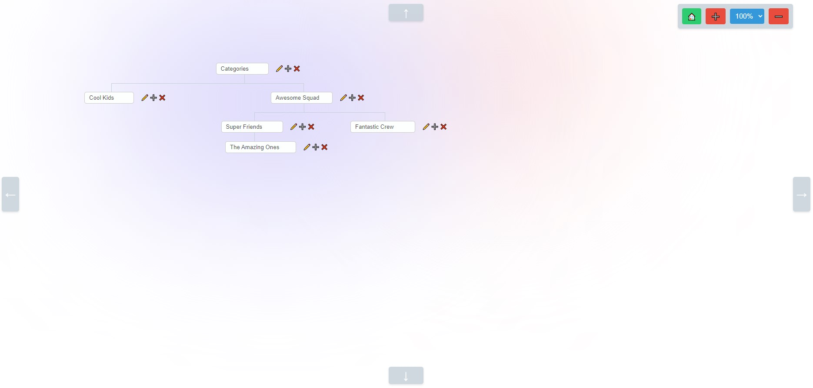

# 🌲 Category Tree Manager App



Category Tree Manager is a web application that allows you to easily manage and organize categories in a tree-like structure. You can view, add, rename, delete, and perform other operations on categories. The application is built using React and TypeScript, bundled with Webpack, and styled using HTML5 and CSS3 with Flexbox for layout.

## Features

- 🌳 View categories in a tree structure.
- ➕ Add new categories.
- 🔄 Rename existing categories.
- 🗑️ Delete categories.
- 🔍 Zoom in and out for a better view.
- 📦 Shift the tree to reposition categories.

## Tech Stack

- React: 🚀 The frontend is built using React to create a responsive and interactive user interface.

- TypeScript: ✨ TypeScript is used to enhance code quality and provide static typing.

- Webpack: 📦 Webpack is used for bundling and optimizing the application.

- HTML5: 🌐 HTML5 is used to structure the application's markup.

- CSS3: 🎨 CSS3 is used for styling the application.

- Flexbox: 📏 Flexbox is used for creating flexible and responsive layouts.

## Getting Started

Follow these steps to get the Category Tree Manager App up and running on your local machine:

1. Clone the repository:

   ```bash
   git clone https://github.com/your-username/category-tree-manager.git
   ```

2. Navigate to the project directory:

   ```bash
   cd category-tree-manager
   ```

3. Install the project dependencies:

   ```bash
   npm install
   ```

4. Start the development server:

   ```bash
   npm start
   ```

5. Open your web browser and visit [http://localhost:3000](http://localhost:3000) to use the app.

## Usage

- To view the category tree, simply start the application. You can zoom in and out and shift the tree to better navigate through categories.

- To add a new category, click on the "+" button.

- To rename a category, click on the "pencil" button.

- To delete a category, click on the "x" button.

## Contact Information

- **Author:** Serhii Nezhyhai
- **Email:** [abc1971h@gmail.com](mailto:abc1971h@gmail.com)
- **Portfolio:** [https://serhii.vercel.app/](https://serhii.vercel.app/)

## License

This project is licensed under the MIT License - see the [LICENSE](LICENSE) file for details.

## Acknowledgments

- Thank you to the open-source community for providing the tools and libraries that made this project possible.

Feel free to contribute to this project by submitting issues or pull requests. Your feedback and contributions are highly appreciated! 🚀
